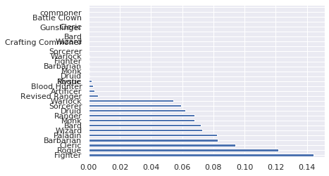
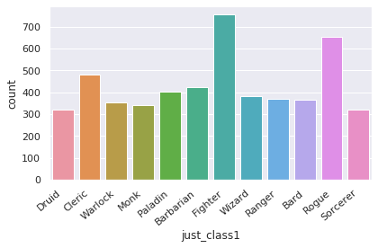
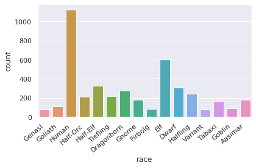
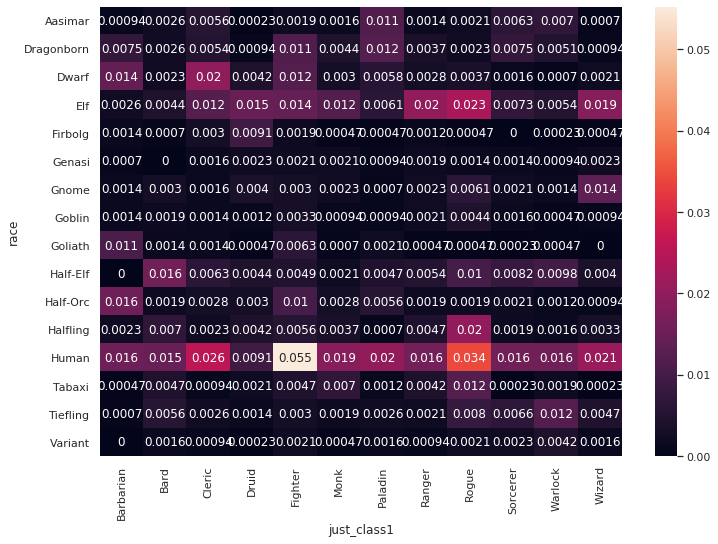
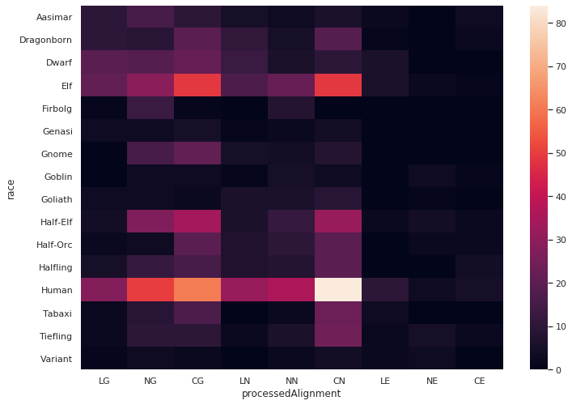

# Dungeons And Dragons and Stats

Dungeons and Dragons is a Tabletop Roleplaying game (RPG) produced by Wizards of the coast.

Data from https://github.com/oganm/dnddata


```
import pandas as pd
import plotly.graph_objects as go
import plotly.express as px
import seaborn as sns
import matplotlib.pyplot as plt
import numpy as np
import scipy.stats as stats
sns.set(style="darkgrid")

```

Lets load in the dataset. Note that this is a tab seperated table. We'll use `\t` as the seperator to get it to load in right.


```
#dnd_df = pd.read_csv("https://raw.githubusercontent.com/ErikSeguinte/dndstats/master/docs/charTable.tsv", sep = '\t')
dnd_df = pd.read_csv('https://raw.githubusercontent.com/oganm/dnddata/master/data-raw/dnd_chars_unique.tsv', sep = '\t')
#dnd_df = pd.read_csv('dnddata/data-raw/dnd_chars_unique.tsv', sep = '\t')

```


```
dnd_df.columns.to_list()
```


    ['ip',
     'finger',
     'hash',
     'name',
     'race',
     'background',
     'date',
     'class',
     'justClass',
     'subclass',
     'level',
     'feats',
     'HP',
     'AC',
     'Str',
     'Dex',
     'Con',
     'Int',
     'Wis',
     'Cha',
     'alignment',
     'skills',
     'weapons',
     'spells',
     'castingStat',
     'choices',
     'country',
     'countryCode',
     'processedAlignment',
     'good',
     'lawful',
     'processedRace',
     'processedSpells',
     'processedWeapons',
     'levelGroup',
     'alias']


```
print(dnd_df.shape)
dnd_df.head()
```

    (4786, 36)


<div>
<style scoped>
    .dataframe tbody tr th:only-of-type {
        vertical-align: middle;
    }

    .dataframe tbody tr th {
        vertical-align: top;
    }

    .dataframe thead th {
        text-align: right;
    }
</style>
<table border="1" class="dataframe">
  <thead>
    <tr style="text-align: right;">
      <th></th>
      <th>ip</th>
      <th>finger</th>
      <th>hash</th>
      <th>name</th>
      <th>race</th>
      <th>background</th>
      <th>date</th>
      <th>class</th>
      <th>justClass</th>
      <th>subclass</th>
      <th>level</th>
      <th>feats</th>
      <th>HP</th>
      <th>AC</th>
      <th>Str</th>
      <th>Dex</th>
      <th>Con</th>
      <th>Int</th>
      <th>Wis</th>
      <th>Cha</th>
      <th>alignment</th>
      <th>skills</th>
      <th>weapons</th>
      <th>spells</th>
      <th>castingStat</th>
      <th>choices</th>
      <th>country</th>
      <th>countryCode</th>
      <th>processedAlignment</th>
      <th>good</th>
      <th>lawful</th>
      <th>processedRace</th>
      <th>processedSpells</th>
      <th>processedWeapons</th>
      <th>levelGroup</th>
      <th>alias</th>
    </tr>
  </thead>
  <tbody>
    <tr>
      <th>0</th>
      <td>fe6a0db</td>
      <td>dfa9438</td>
      <td>9db89a1c2df98d839bb95fbb4337ffa1</td>
      <td>5598141</td>
      <td>Fire Genasi</td>
      <td>Hermit</td>
      <td>2019-12-31T20:40:46Z</td>
      <td>Druid 20</td>
      <td>Druid</td>
      <td>Circle of the Moon</td>
      <td>20</td>
      <td>NaN</td>
      <td>203</td>
      <td>14</td>
      <td>15</td>
      <td>17</td>
      <td>20</td>
      <td>18</td>
      <td>20</td>
      <td>14</td>
      <td>NaN</td>
      <td>Nature|Religion|Animal Handling|Medicine</td>
      <td>Quarterstaff|Scimitar</td>
      <td>NaN</td>
      <td>Wis</td>
      <td>NaN</td>
      <td>United States</td>
      <td>US</td>
      <td>NaN</td>
      <td>NaN</td>
      <td>NaN</td>
      <td>Genasi</td>
      <td>NaN</td>
      <td>Quarterstaff|Scimitar</td>
      <td>19-20</td>
      <td>heuristic_hamilton</td>
    </tr>
    <tr>
      <th>1</th>
      <td>fe6a0db</td>
      <td>dfa9438</td>
      <td>c4859de3f51355111d33c17c231b1f1f</td>
      <td>5b7f0c0</td>
      <td>Kenku</td>
      <td>Acolyte</td>
      <td>2019-12-31T18:01:13Z</td>
      <td>Cleric 20</td>
      <td>Cleric</td>
      <td>Life Domain</td>
      <td>20</td>
      <td>Healer|Linguist</td>
      <td>180</td>
      <td>18</td>
      <td>11</td>
      <td>11</td>
      <td>16</td>
      <td>14</td>
      <td>16</td>
      <td>11</td>
      <td>NaN</td>
      <td>Acrobatics|Sleight of Hand|Religion|Insight|Me...</td>
      <td>Mace|Crossbow, light</td>
      <td>Bless*1|Cure Wounds*1|Lesser Restoration*2|Spi...</td>
      <td>Wis</td>
      <td>NaN</td>
      <td>United States</td>
      <td>US</td>
      <td>NaN</td>
      <td>NaN</td>
      <td>NaN</td>
      <td>Kenku</td>
      <td>Bless*1|Cure Wounds*1|Lesser Restoration*2|Spi...</td>
      <td>Mace|Crossbow, Light</td>
      <td>19-20</td>
      <td>pedantic_vaughan</td>
    </tr>
    <tr>
      <th>2</th>
      <td>fbbc565</td>
      <td>acf7615</td>
      <td>0ca83c2f792caad71a28e27264c82a3e</td>
      <td>ad4efc7</td>
      <td>Triton</td>
      <td>Haunted One</td>
      <td>2019-12-18T22:30:54Z</td>
      <td>Warlock 20</td>
      <td>Warlock</td>
      <td>The Great Old One</td>
      <td>20</td>
      <td>Spell Sniper</td>
      <td>206</td>
      <td>14</td>
      <td>20</td>
      <td>18</td>
      <td>20</td>
      <td>10</td>
      <td>12</td>
      <td>20</td>
      <td>NaN</td>
      <td>Arcana|Investigation|Religion|Survival</td>
      <td>Trident</td>
      <td>NaN</td>
      <td>Cha</td>
      <td>eldritch invocations/Armor of Shadows*Agonizin...</td>
      <td>United States</td>
      <td>US</td>
      <td>NaN</td>
      <td>NaN</td>
      <td>NaN</td>
      <td>Triton</td>
      <td>NaN</td>
      <td>Trident</td>
      <td>19-20</td>
      <td>optimistic_hawking</td>
    </tr>
    <tr>
      <th>3</th>
      <td>771e3c1</td>
      <td>acf7615</td>
      <td>a425e37f4210bee779f131cb07ef05a3</td>
      <td>14b10ec</td>
      <td>Triton</td>
      <td>Mercenary Veteran</td>
      <td>2019-12-15T17:39:15Z</td>
      <td>Monk 20</td>
      <td>Monk</td>
      <td>Way of the Kensei</td>
      <td>20</td>
      <td>NaN</td>
      <td>157</td>
      <td>19</td>
      <td>20</td>
      <td>20</td>
      <td>15</td>
      <td>11</td>
      <td>18</td>
      <td>13</td>
      <td>NaN</td>
      <td>Athletics|Acrobatics|Stealth|Persuasion</td>
      <td>Unarmed Strike|Longbow|Trident</td>
      <td>NaN</td>
      <td>Wis</td>
      <td>NaN</td>
      <td>United States</td>
      <td>US</td>
      <td>NaN</td>
      <td>NaN</td>
      <td>NaN</td>
      <td>Triton</td>
      <td>NaN</td>
      <td>Unarmed Strike|Longbow|Trident</td>
      <td>19-20</td>
      <td>jovial_bassi</td>
    </tr>
    <tr>
      <th>4</th>
      <td>1c797fe</td>
      <td>dbb4eaa</td>
      <td>401ef00cd4e04844a75d4ca084e7b309</td>
      <td>8090ffe</td>
      <td>Goliath</td>
      <td>Noble</td>
      <td>2019-12-08T12:31:07Z</td>
      <td>Paladin 20</td>
      <td>Paladin</td>
      <td>Oath of Conquest</td>
      <td>20</td>
      <td>NaN</td>
      <td>279</td>
      <td>20</td>
      <td>29</td>
      <td>18</td>
      <td>24</td>
      <td>18</td>
      <td>18</td>
      <td>20</td>
      <td>NaN</td>
      <td>Athletics|History|Persuasion</td>
      <td>Warhammer|Javelin</td>
      <td>Armor of Frost*1|Command*1|Hold Person*2|Spiri...</td>
      <td>Cha</td>
      <td>fighting style/Dueling</td>
      <td>United States</td>
      <td>US</td>
      <td>NaN</td>
      <td>NaN</td>
      <td>NaN</td>
      <td>Goliath</td>
      <td>*|Command*1|Hold Person*2|Spiritual Weapon*2|B...</td>
      <td>Warhammer|Javelin</td>
      <td>19-20</td>
      <td>fervent_rubin</td>
    </tr>
  </tbody>
</table>
</div>


```
dnd_df = dnd_df.drop(['ip', 'finger', 'hash', 'name', 'countryCode', 'country', 'justClass', 'alias', 'levelGroup', 'processedRace'], axis=1)
```

The maintainer of this Dataset already did some processing and cleanup. (See the `Processed*` columns, but we're going to ignore those. This is supposed to be a learning experience, right?

Lets start with classes. What do these values look like?


```
pd.set_option('display.max_rows', 50)
pd.set_option('min_rows', 20)
pd.options.display.max_rows = 50
dnd_df['class'].value_counts()

```


    Rogue 1                        157
    Fighter 1                      133
    Cleric 1                       129
    Bard 1                          97
    Fighter 3                       97
    Paladin 1                       96
    Wizard 1                        94
    Barbarian 1                     91
    Ranger 1                        89
    Sorcerer 1                      82
                                  ... 
    Paladin 17                       1
    Fighter 3|Warlock 2|Bard 10      1
    Sorcerer 13                      1
    Blood Hunter 7                   1
    \nSorcerer 5                     1
    Cleric 10|Paladin 5              1
    Paladin 7|Warlock 1              1
    Rogue 8|Fighter 1                1
    Cleric 1|Wizard 13               1
    Rogue 6|Fighter 4                1
    Name: class, Length: 732, dtype: int64


Looks like there are a few issues. The first is that Class and level have been combined. So a 1st level wizard is in listed as `Wizard 1`. We'll want to split those up into class and level.

The next thing is multiclassing. Someone can be `wizard 1` and `barbarian 2`. In the data, they are seperated by the `|` character. We'll start by cleaning this up.

First, we'll use the `str.split()` function of the `pd.DataFrame` class to turn this string into a list of strings. Note that rows with only a single class are still turned into a list with 1 element. While we're at it, let's clean it of stray spaces or newlines, and drop anyone with more than 2 classes.


```
dnd_df['class'] = dnd_df['class'].str.split('|')
dnd_df['class']
```


    0                     [Druid 20]
    1                    [Cleric 20]
    2                   [Warlock 20]
    3                      [Monk 20]
    4                   [Paladin 20]
    5                 [Barbarian 20]
    6                   [Warlock 20]
    7                   [Warlock 20]
    8                   [Paladin 20]
    9                   [Paladin 20]
                      ...           
    4776       [Fighter 1, Wizard 1]
    4777        [Fighter 1, Rogue 1]
    4778    [Fighter 1, Barbarian 1]
    4779         [Monk 1, Fighter 1]
    4780    [Barbarian 1, Fighter 1]
    4781        [Rogue 1, Warlock 1]
    4782        [Bard 1, Sorcerer 1]
    4783         [Rogue 1, Ranger 1]
    4784        [Fighter 1, Rogue 1]
    4785    [Fighter 1, Barbarian 1]
    Name: class, Length: 4786, dtype: object


```
# Drop anyone with more than 2 classes
valid_multiclass = dnd_df['class'].str.len() <= 2
dnd_df = dnd_df[valid_multiclass]

```


```
# Split Class list into 2 columns, class 1 and 2
dnd_df[['class1', 'class2']] = pd.DataFrame(dnd_df['class'].values.tolist(), index = dnd_df.index)

```


```
dnd_df[['just_class1', 'just_level1']] = pd.DataFrame(dnd_df['class1'].str.rsplit(" ",1, expand = True).values, index = dnd_df.index)
dnd_df[['just_class2', 'just_level2']] = pd.DataFrame(dnd_df['class2'].str.rsplit(" ",1, expand = True).values, index = dnd_df.index)
```


```
dnd_df['just_class1'].value_counts(normalize=True).plot(kind='barh');
```





There's a lot in there! Let's filter our df to only include the top 12 or so classes.


```
def graph_counts(df, label):
  ax = sns.countplot(x = label, data=df,)
  ax.set_xticklabels(ax.get_xticklabels(), rotation=40, ha="right")
  plt.tight_layout()
  plt.show();

def graph_series(s):
  ax = sns.countplot(x = s.index, data=s)
  ax.set_xticklabels(ax.get_xticklabels(), rotation=40, ha="right")
  plt.tight_layout()
  plt.show();

def clean_string(s:str):
    if isinstance(s, str):
        split = s.split(' ')
        return split[-1].strip().title()
```


```
second_class_df = dnd_df[dnd_df['just_class2'].notnull()].copy()
```


```
second_class_df[['just_class1', 'just_level1']] = second_class_df[['just_class2', 'just_level2']].copy()
```

* Adding second class to the bottom of first class. This way, a warlock/fighter would count as both a fighter and a warlock in the data.


```
dnd_df = pd.concat([dnd_df, second_class_df]).copy()
```


```
dnd_df = dnd_df.drop(['date','class', 'processedWeapons','processedSpells', 'just_class2', 'just_level2'],axis = 1)

```


```
dnd_df['just_class1'] = dnd_df['just_class1'].apply(clean_string)
dnd_df['just_class1'].value_counts()
```


    Fighter       756
    Rogue         653
    Cleric        481
    Barbarian     421
    Paladin       401
    Wizard        381
    Ranger        368
    Bard          365
    Warlock       351
    Monk          340
    Sorcerer      320
    Druid         319
    Artificer      19
    Hunter         14
    Mystic         11
    Commoner        2
    Gunslinger      1
    Clown           1
                    1
    Name: just_class1, dtype: int64


```
unusual_classes = dnd_df['just_class1'].value_counts()[12:].index.to_list()
unusual_classes
```


    ['Artificer', 'Hunter', 'Mystic', 'Commoner', 'Gunslinger', 'Clown', '']


```
dnd_df = dnd_df[~(dnd_df['just_class1'].isin(unusual_classes))]
```


```
graph_counts(dnd_df, 'just_class1')
```





```
race_and_class = pd.crosstab(dnd_df['just_class1'], dnd_df['race']).T
```


```
race_and_class
```


<div>
<style scoped>
    .dataframe tbody tr th:only-of-type {
        vertical-align: middle;
    }

    .dataframe tbody tr th {
        vertical-align: top;
    }

    .dataframe thead th {
        text-align: right;
    }
</style>
<table border="1" class="dataframe">
  <thead>
    <tr style="text-align: right;">
      <th>just_class1</th>
      <th>Barbarian</th>
      <th>Bard</th>
      <th>Cleric</th>
      <th>Druid</th>
      <th>Fighter</th>
      <th>Monk</th>
      <th>Paladin</th>
      <th>Ranger</th>
      <th>Rogue</th>
      <th>Sorcerer</th>
      <th>Warlock</th>
      <th>Wizard</th>
    </tr>
    <tr>
      <th>race</th>
      <th></th>
      <th></th>
      <th></th>
      <th></th>
      <th></th>
      <th></th>
      <th></th>
      <th></th>
      <th></th>
      <th></th>
      <th></th>
      <th></th>
    </tr>
  </thead>
  <tbody>
    <tr>
      <th>1/2 Elf--Var.</th>
      <td>0</td>
      <td>0</td>
      <td>0</td>
      <td>0</td>
      <td>0</td>
      <td>0</td>
      <td>1</td>
      <td>0</td>
      <td>0</td>
      <td>0</td>
      <td>0</td>
      <td>0</td>
    </tr>
    <tr>
      <th>Aarakocra</th>
      <td>4</td>
      <td>2</td>
      <td>6</td>
      <td>2</td>
      <td>0</td>
      <td>8</td>
      <td>2</td>
      <td>12</td>
      <td>2</td>
      <td>1</td>
      <td>4</td>
      <td>2</td>
    </tr>
    <tr>
      <th>Aasimar</th>
      <td>2</td>
      <td>0</td>
      <td>1</td>
      <td>0</td>
      <td>0</td>
      <td>1</td>
      <td>2</td>
      <td>0</td>
      <td>2</td>
      <td>3</td>
      <td>1</td>
      <td>0</td>
    </tr>
    <tr>
      <th>Air Genasi</th>
      <td>0</td>
      <td>0</td>
      <td>3</td>
      <td>2</td>
      <td>1</td>
      <td>3</td>
      <td>0</td>
      <td>6</td>
      <td>3</td>
      <td>1</td>
      <td>2</td>
      <td>2</td>
    </tr>
    <tr>
      <th>Animal Hybrid</th>
      <td>2</td>
      <td>0</td>
      <td>1</td>
      <td>0</td>
      <td>1</td>
      <td>3</td>
      <td>2</td>
      <td>0</td>
      <td>1</td>
      <td>0</td>
      <td>1</td>
      <td>1</td>
    </tr>
    <tr>
      <th>Animal Hybrid (Bear)</th>
      <td>1</td>
      <td>0</td>
      <td>0</td>
      <td>0</td>
      <td>0</td>
      <td>0</td>
      <td>0</td>
      <td>0</td>
      <td>0</td>
      <td>0</td>
      <td>0</td>
      <td>0</td>
    </tr>
    <tr>
      <th>Beast</th>
      <td>0</td>
      <td>0</td>
      <td>0</td>
      <td>1</td>
      <td>0</td>
      <td>0</td>
      <td>0</td>
      <td>0</td>
      <td>0</td>
      <td>0</td>
      <td>0</td>
      <td>0</td>
    </tr>
    <tr>
      <th>Beasthide</th>
      <td>0</td>
      <td>0</td>
      <td>0</td>
      <td>1</td>
      <td>0</td>
      <td>1</td>
      <td>0</td>
      <td>0</td>
      <td>0</td>
      <td>0</td>
      <td>0</td>
      <td>0</td>
    </tr>
    <tr>
      <th>Birdfolk</th>
      <td>1</td>
      <td>0</td>
      <td>1</td>
      <td>1</td>
      <td>1</td>
      <td>0</td>
      <td>0</td>
      <td>0</td>
      <td>1</td>
      <td>0</td>
      <td>0</td>
      <td>0</td>
    </tr>
    <tr>
      <th>Bugbear</th>
      <td>11</td>
      <td>2</td>
      <td>0</td>
      <td>2</td>
      <td>12</td>
      <td>3</td>
      <td>3</td>
      <td>1</td>
      <td>3</td>
      <td>1</td>
      <td>0</td>
      <td>1</td>
    </tr>
    <tr>
      <th>...</th>
      <td>...</td>
      <td>...</td>
      <td>...</td>
      <td>...</td>
      <td>...</td>
      <td>...</td>
      <td>...</td>
      <td>...</td>
      <td>...</td>
      <td>...</td>
      <td>...</td>
      <td>...</td>
    </tr>
    <tr>
      <th>Wolf</th>
      <td>0</td>
      <td>0</td>
      <td>0</td>
      <td>0</td>
      <td>1</td>
      <td>0</td>
      <td>0</td>
      <td>0</td>
      <td>0</td>
      <td>0</td>
      <td>0</td>
      <td>0</td>
    </tr>
    <tr>
      <th>Wood Elf</th>
      <td>6</td>
      <td>2</td>
      <td>28</td>
      <td>49</td>
      <td>23</td>
      <td>38</td>
      <td>2</td>
      <td>70</td>
      <td>37</td>
      <td>5</td>
      <td>4</td>
      <td>6</td>
    </tr>
    <tr>
      <th>Yordle</th>
      <td>0</td>
      <td>0</td>
      <td>0</td>
      <td>0</td>
      <td>0</td>
      <td>0</td>
      <td>0</td>
      <td>0</td>
      <td>0</td>
      <td>0</td>
      <td>1</td>
      <td>0</td>
    </tr>
    <tr>
      <th>Yuan-Ti</th>
      <td>0</td>
      <td>0</td>
      <td>1</td>
      <td>0</td>
      <td>0</td>
      <td>0</td>
      <td>0</td>
      <td>0</td>
      <td>0</td>
      <td>0</td>
      <td>0</td>
      <td>0</td>
    </tr>
    <tr>
      <th>Yuan-ti Pureblood</th>
      <td>0</td>
      <td>0</td>
      <td>1</td>
      <td>0</td>
      <td>0</td>
      <td>0</td>
      <td>0</td>
      <td>0</td>
      <td>0</td>
      <td>0</td>
      <td>0</td>
      <td>0</td>
    </tr>
    <tr>
      <th>firbolg</th>
      <td>1</td>
      <td>0</td>
      <td>0</td>
      <td>0</td>
      <td>0</td>
      <td>0</td>
      <td>0</td>
      <td>0</td>
      <td>0</td>
      <td>0</td>
      <td>0</td>
      <td>0</td>
    </tr>
    <tr>
      <th>moon Elf</th>
      <td>0</td>
      <td>0</td>
      <td>0</td>
      <td>1</td>
      <td>0</td>
      <td>0</td>
      <td>0</td>
      <td>0</td>
      <td>0</td>
      <td>0</td>
      <td>0</td>
      <td>0</td>
    </tr>
    <tr>
      <th>naga</th>
      <td>0</td>
      <td>0</td>
      <td>0</td>
      <td>0</td>
      <td>0</td>
      <td>0</td>
      <td>0</td>
      <td>1</td>
      <td>1</td>
      <td>0</td>
      <td>0</td>
      <td>0</td>
    </tr>
    <tr>
      <th>warforged (envoy)</th>
      <td>0</td>
      <td>0</td>
      <td>0</td>
      <td>0</td>
      <td>1</td>
      <td>0</td>
      <td>0</td>
      <td>0</td>
      <td>0</td>
      <td>0</td>
      <td>0</td>
      <td>0</td>
    </tr>
    <tr>
      <th>👨 Human</th>
      <td>0</td>
      <td>1</td>
      <td>0</td>
      <td>0</td>
      <td>0</td>
      <td>0</td>
      <td>0</td>
      <td>0</td>
      <td>0</td>
      <td>0</td>
      <td>0</td>
      <td>1</td>
    </tr>
  </tbody>
</table>
<p>189 rows × 12 columns</p>
</div>


Races are mixed in with subraces, which makes it more difficult to classify.

`Wood Elf` should really just be `Elf`, with a subrace of `Wood Elf`

For the most part, we can classify them by splitting them and taking the  last word.

And we'll drop any unusual races too


```
def clean_race(s:str):
    if isinstance(s, str):
        split = s.split(' ')
        return split[-1].strip().title()


        
```


```
dnd_df['race'] = dnd_df['race'].apply(clean_race)
dnd_df
```


<div>
<style scoped>
    .dataframe tbody tr th:only-of-type {
        vertical-align: middle;
    }

    .dataframe tbody tr th {
        vertical-align: top;
    }

    .dataframe thead th {
        text-align: right;
    }
</style>
<table border="1" class="dataframe">
  <thead>
    <tr style="text-align: right;">
      <th></th>
      <th>race</th>
      <th>background</th>
      <th>subclass</th>
      <th>level</th>
      <th>feats</th>
      <th>HP</th>
      <th>AC</th>
      <th>Str</th>
      <th>Dex</th>
      <th>Con</th>
      <th>Int</th>
      <th>Wis</th>
      <th>Cha</th>
      <th>alignment</th>
      <th>skills</th>
      <th>weapons</th>
      <th>spells</th>
      <th>castingStat</th>
      <th>choices</th>
      <th>processedAlignment</th>
      <th>good</th>
      <th>lawful</th>
      <th>class1</th>
      <th>class2</th>
      <th>just_class1</th>
      <th>just_level1</th>
    </tr>
  </thead>
  <tbody>
    <tr>
      <th>0</th>
      <td>Genasi</td>
      <td>Hermit</td>
      <td>Circle of the Moon</td>
      <td>20</td>
      <td>NaN</td>
      <td>203</td>
      <td>14</td>
      <td>15</td>
      <td>17</td>
      <td>20</td>
      <td>18</td>
      <td>20</td>
      <td>14</td>
      <td>NaN</td>
      <td>Nature|Religion|Animal Handling|Medicine</td>
      <td>Quarterstaff|Scimitar</td>
      <td>NaN</td>
      <td>Wis</td>
      <td>NaN</td>
      <td>NaN</td>
      <td>NaN</td>
      <td>NaN</td>
      <td>Druid 20</td>
      <td>None</td>
      <td>Druid</td>
      <td>20</td>
    </tr>
    <tr>
      <th>1</th>
      <td>Kenku</td>
      <td>Acolyte</td>
      <td>Life Domain</td>
      <td>20</td>
      <td>Healer|Linguist</td>
      <td>180</td>
      <td>18</td>
      <td>11</td>
      <td>11</td>
      <td>16</td>
      <td>14</td>
      <td>16</td>
      <td>11</td>
      <td>NaN</td>
      <td>Acrobatics|Sleight of Hand|Religion|Insight|Me...</td>
      <td>Mace|Crossbow, light</td>
      <td>Bless*1|Cure Wounds*1|Lesser Restoration*2|Spi...</td>
      <td>Wis</td>
      <td>NaN</td>
      <td>NaN</td>
      <td>NaN</td>
      <td>NaN</td>
      <td>Cleric 20</td>
      <td>None</td>
      <td>Cleric</td>
      <td>20</td>
    </tr>
    <tr>
      <th>2</th>
      <td>Triton</td>
      <td>Haunted One</td>
      <td>The Great Old One</td>
      <td>20</td>
      <td>Spell Sniper</td>
      <td>206</td>
      <td>14</td>
      <td>20</td>
      <td>18</td>
      <td>20</td>
      <td>10</td>
      <td>12</td>
      <td>20</td>
      <td>NaN</td>
      <td>Arcana|Investigation|Religion|Survival</td>
      <td>Trident</td>
      <td>NaN</td>
      <td>Cha</td>
      <td>eldritch invocations/Armor of Shadows*Agonizin...</td>
      <td>NaN</td>
      <td>NaN</td>
      <td>NaN</td>
      <td>Warlock 20</td>
      <td>None</td>
      <td>Warlock</td>
      <td>20</td>
    </tr>
    <tr>
      <th>3</th>
      <td>Triton</td>
      <td>Mercenary Veteran</td>
      <td>Way of the Kensei</td>
      <td>20</td>
      <td>NaN</td>
      <td>157</td>
      <td>19</td>
      <td>20</td>
      <td>20</td>
      <td>15</td>
      <td>11</td>
      <td>18</td>
      <td>13</td>
      <td>NaN</td>
      <td>Athletics|Acrobatics|Stealth|Persuasion</td>
      <td>Unarmed Strike|Longbow|Trident</td>
      <td>NaN</td>
      <td>Wis</td>
      <td>NaN</td>
      <td>NaN</td>
      <td>NaN</td>
      <td>NaN</td>
      <td>Monk 20</td>
      <td>None</td>
      <td>Monk</td>
      <td>20</td>
    </tr>
    <tr>
      <th>4</th>
      <td>Goliath</td>
      <td>Noble</td>
      <td>Oath of Conquest</td>
      <td>20</td>
      <td>NaN</td>
      <td>279</td>
      <td>20</td>
      <td>29</td>
      <td>18</td>
      <td>24</td>
      <td>18</td>
      <td>18</td>
      <td>20</td>
      <td>NaN</td>
      <td>Athletics|History|Persuasion</td>
      <td>Warhammer|Javelin</td>
      <td>Armor of Frost*1|Command*1|Hold Person*2|Spiri...</td>
      <td>Cha</td>
      <td>fighting style/Dueling</td>
      <td>NaN</td>
      <td>NaN</td>
      <td>NaN</td>
      <td>Paladin 20</td>
      <td>None</td>
      <td>Paladin</td>
      <td>20</td>
    </tr>
    <tr>
      <th>5</th>
      <td>Human</td>
      <td>Sailor</td>
      <td>Path of the Storm Herald</td>
      <td>20</td>
      <td>Polearm Master|Tough</td>
      <td>301</td>
      <td>22</td>
      <td>24</td>
      <td>17</td>
      <td>24</td>
      <td>13</td>
      <td>16</td>
      <td>12</td>
      <td>NaN</td>
      <td>Athletics|Animal Handling|Perception|Survival</td>
      <td>Glaive|Javelin|Javelin</td>
      <td>NaN</td>
      <td>Int</td>
      <td>NaN</td>
      <td>NaN</td>
      <td>NaN</td>
      <td>NaN</td>
      <td>Barbarian 20</td>
      <td>None</td>
      <td>Barbarian</td>
      <td>20</td>
    </tr>
    <tr>
      <th>6</th>
      <td>Half-Orc</td>
      <td>Sailor</td>
      <td>The Great Old One</td>
      <td>20</td>
      <td>War Caster|Actor|Observant</td>
      <td>202</td>
      <td>13</td>
      <td>20</td>
      <td>13</td>
      <td>18</td>
      <td>14</td>
      <td>15</td>
      <td>17</td>
      <td>NaN</td>
      <td>Athletics|Arcana|Investigation|Perception|Dece...</td>
      <td>Falchion (Scimitar)|Eldritch Blast</td>
      <td>Chill Touch*0|Eldritch Blast*0|Mage Hand*0|Min...</td>
      <td>Cha</td>
      <td>pact boon/Pact of the Blade|eldritch invocatio...</td>
      <td>NaN</td>
      <td>NaN</td>
      <td>NaN</td>
      <td>Warlock 20</td>
      <td>None</td>
      <td>Warlock</td>
      <td>20</td>
    </tr>
    <tr>
      <th>7</th>
      <td>Triton</td>
      <td>Charlatan</td>
      <td>The Great Old One</td>
      <td>20</td>
      <td>Spell Sniper</td>
      <td>209</td>
      <td>13</td>
      <td>10</td>
      <td>17</td>
      <td>20</td>
      <td>10</td>
      <td>11</td>
      <td>20</td>
      <td>NaN</td>
      <td>Sleight of Hand|Arcana|Religion|Deception</td>
      <td>Dagger</td>
      <td>NaN</td>
      <td>Cha</td>
      <td>eldritch invocations/Agonizing Blast*Devil's S...</td>
      <td>NaN</td>
      <td>NaN</td>
      <td>NaN</td>
      <td>Warlock 20</td>
      <td>None</td>
      <td>Warlock</td>
      <td>20</td>
    </tr>
    <tr>
      <th>8</th>
      <td>Half-Elf</td>
      <td>Acolyte</td>
      <td>Oath of Vengeance</td>
      <td>20</td>
      <td>NaN</td>
      <td>255</td>
      <td>24</td>
      <td>20</td>
      <td>14</td>
      <td>20</td>
      <td>14</td>
      <td>15</td>
      <td>20</td>
      <td>CN</td>
      <td>Athletics|Arcana|Religion|Insight|Persuasion</td>
      <td>Longsword|Longsword|Longsword|Sparky Sparky Bo...</td>
      <td>Bane*1|Hunter’s Mark*1|Divine Favor*1|Sheild O...</td>
      <td>Cha</td>
      <td>fighting style/Protection</td>
      <td>CN</td>
      <td>NaN</td>
      <td>NaN</td>
      <td>Paladin 20</td>
      <td>None</td>
      <td>Paladin</td>
      <td>20</td>
    </tr>
    <tr>
      <th>9</th>
      <td>Tiefling</td>
      <td>Acolyte</td>
      <td>OathBreaker</td>
      <td>20</td>
      <td>NaN</td>
      <td>225</td>
      <td>19</td>
      <td>18</td>
      <td>15</td>
      <td>16</td>
      <td>16</td>
      <td>8</td>
      <td>12</td>
      <td>NaN</td>
      <td>Athletics|Religion|Insight|Intimidation</td>
      <td>Battleaxe|Dagger</td>
      <td>Hellish Rebuke*1|Inflict Wounds*1|Crown of Mad...</td>
      <td>Cha</td>
      <td>fighting style/Defense|tiefling variants menu/...</td>
      <td>NaN</td>
      <td>NaN</td>
      <td>NaN</td>
      <td>Paladin 20</td>
      <td>None</td>
      <td>Paladin</td>
      <td>20</td>
    </tr>
    <tr>
      <th>...</th>
      <td>...</td>
      <td>...</td>
      <td>...</td>
      <td>...</td>
      <td>...</td>
      <td>...</td>
      <td>...</td>
      <td>...</td>
      <td>...</td>
      <td>...</td>
      <td>...</td>
      <td>...</td>
      <td>...</td>
      <td>...</td>
      <td>...</td>
      <td>...</td>
      <td>...</td>
      <td>...</td>
      <td>...</td>
      <td>...</td>
      <td>...</td>
      <td>...</td>
      <td>...</td>
      <td>...</td>
      <td>...</td>
      <td>...</td>
    </tr>
    <tr>
      <th>4776</th>
      <td>Human</td>
      <td>Knight</td>
      <td>|</td>
      <td>2</td>
      <td>War Caster</td>
      <td>21</td>
      <td>19</td>
      <td>16</td>
      <td>11</td>
      <td>16</td>
      <td>14</td>
      <td>10</td>
      <td>10</td>
      <td>CG</td>
      <td>Athletics|Arcana|Medicine|Perception|Persuasion</td>
      <td>Longsword|Handaxe</td>
      <td>Light*0|Green Flame Blade*0|Prestedigitation*0...</td>
      <td>Int</td>
      <td>fighting style/Defense</td>
      <td>CG</td>
      <td>NaN</td>
      <td>NaN</td>
      <td>Fighter 1</td>
      <td>Wizard 1</td>
      <td>Wizard</td>
      <td>1</td>
    </tr>
    <tr>
      <th>4777</th>
      <td>Human</td>
      <td>Outlander</td>
      <td>|</td>
      <td>2</td>
      <td>Grappler</td>
      <td>19</td>
      <td>12</td>
      <td>15</td>
      <td>13</td>
      <td>14</td>
      <td>8</td>
      <td>10</td>
      <td>14</td>
      <td>CG</td>
      <td>Athletics|Acrobatics|Insight|Survival|Intimida...</td>
      <td>Longbow|Shortsword|Shortsword|Handaxe</td>
      <td>NaN</td>
      <td>Int</td>
      <td>expertise/Insight*Athletics|fighting style/Two...</td>
      <td>CG</td>
      <td>NaN</td>
      <td>NaN</td>
      <td>Fighter 1</td>
      <td>Rogue 1</td>
      <td>Rogue</td>
      <td>1</td>
    </tr>
    <tr>
      <th>4778</th>
      <td>Human</td>
      <td>Outlander</td>
      <td>|</td>
      <td>2</td>
      <td>Dual Wielder</td>
      <td>21</td>
      <td>15</td>
      <td>16</td>
      <td>12</td>
      <td>14</td>
      <td>8</td>
      <td>10</td>
      <td>14</td>
      <td>NaN</td>
      <td>Athletics|Stealth|Perception|Survival|Intimida...</td>
      <td>Battleaxe|Battleaxe Rage</td>
      <td>NaN</td>
      <td>Int</td>
      <td>fighting style/Two-Weapon Fighting</td>
      <td>NaN</td>
      <td>NaN</td>
      <td>NaN</td>
      <td>Fighter 1</td>
      <td>Barbarian 1</td>
      <td>Barbarian</td>
      <td>1</td>
    </tr>
    <tr>
      <th>4779</th>
      <td>Tabaxi</td>
      <td>Custom</td>
      <td>|</td>
      <td>2</td>
      <td>NaN</td>
      <td>16</td>
      <td>15</td>
      <td>12</td>
      <td>16</td>
      <td>12</td>
      <td>10</td>
      <td>14</td>
      <td>12</td>
      <td>NaN</td>
      <td>Athletics|Acrobatics|Stealth|Religion|Insight|...</td>
      <td>Shortsword|Dart|Unarmed strike</td>
      <td>NaN</td>
      <td>Int</td>
      <td>fighting style/Dueling</td>
      <td>NaN</td>
      <td>NaN</td>
      <td>NaN</td>
      <td>Monk 1</td>
      <td>Fighter 1</td>
      <td>Fighter</td>
      <td>1</td>
    </tr>
    <tr>
      <th>4780</th>
      <td>Lizardfolk</td>
      <td>Barbarian Tribe Member</td>
      <td>|</td>
      <td>2</td>
      <td>NaN</td>
      <td>24</td>
      <td>15</td>
      <td>14</td>
      <td>14</td>
      <td>16</td>
      <td>9</td>
      <td>14</td>
      <td>8</td>
      <td>NaN</td>
      <td>Athletics|Nature|Animal Handling|Survival|Inti...</td>
      <td>Battleaxe|Battleaxe</td>
      <td>NaN</td>
      <td>Int</td>
      <td>fighting style/Two-Weapon Fighting</td>
      <td>NaN</td>
      <td>NaN</td>
      <td>NaN</td>
      <td>Barbarian 1</td>
      <td>Fighter 1</td>
      <td>Fighter</td>
      <td>1</td>
    </tr>
    <tr>
      <th>4781</th>
      <td>Genasi</td>
      <td>Haunted One</td>
      <td>|The Undying</td>
      <td>2</td>
      <td>NaN</td>
      <td>19</td>
      <td>14</td>
      <td>8</td>
      <td>16</td>
      <td>16</td>
      <td>14</td>
      <td>8</td>
      <td>13</td>
      <td>NaN</td>
      <td>Acrobatics|Sleight of Hand|Stealth|Investigati...</td>
      <td>NaN</td>
      <td>Spare the Dying*0|Mage Hand*0|Chill Touch*0|Un...</td>
      <td>Int</td>
      <td>expertise/Stealth*Acrobatics</td>
      <td>NaN</td>
      <td>NaN</td>
      <td>NaN</td>
      <td>Rogue 1</td>
      <td>Warlock 1</td>
      <td>Warlock</td>
      <td>1</td>
    </tr>
    <tr>
      <th>4782</th>
      <td>Kenku</td>
      <td>Entertainer</td>
      <td>|Shadow Magic</td>
      <td>2</td>
      <td>NaN</td>
      <td>14</td>
      <td>14</td>
      <td>10</td>
      <td>17</td>
      <td>12</td>
      <td>8</td>
      <td>14</td>
      <td>14</td>
      <td>NaN</td>
      <td>Acrobatics|Investigation|Insight|Perception|De...</td>
      <td>Rapier|Dagger</td>
      <td>Minor Image*0|Vicious Mockery*0|Message*0|Ligh...</td>
      <td>Cha</td>
      <td>NaN</td>
      <td>NaN</td>
      <td>NaN</td>
      <td>NaN</td>
      <td>Bard 1</td>
      <td>Sorcerer 1</td>
      <td>Sorcerer</td>
      <td>1</td>
    </tr>
    <tr>
      <th>4783</th>
      <td>Human</td>
      <td>Urchin</td>
      <td>|</td>
      <td>2</td>
      <td>NaN</td>
      <td>18</td>
      <td>14</td>
      <td>9</td>
      <td>16</td>
      <td>15</td>
      <td>11</td>
      <td>13</td>
      <td>14</td>
      <td>NaN</td>
      <td>Sleight of Hand|Stealth|Investigation|Insight|...</td>
      <td>Shortsword|Shortbow|Dagger</td>
      <td>NaN</td>
      <td>Int</td>
      <td>expertise/Thieves' Tools*Stealth</td>
      <td>NaN</td>
      <td>NaN</td>
      <td>NaN</td>
      <td>Rogue 1</td>
      <td>Ranger 1</td>
      <td>Ranger</td>
      <td>1</td>
    </tr>
    <tr>
      <th>4784</th>
      <td>Human</td>
      <td>Noble</td>
      <td>|</td>
      <td>2</td>
      <td>NaN</td>
      <td>15</td>
      <td>16</td>
      <td>12</td>
      <td>13</td>
      <td>10</td>
      <td>11</td>
      <td>11</td>
      <td>17</td>
      <td>NaN</td>
      <td>Acrobatics|History|Investigation|Animal Handli...</td>
      <td>Rapier|Dagger</td>
      <td>NaN</td>
      <td>Int</td>
      <td>fighting style/Dueling|expertise/Investigation...</td>
      <td>NaN</td>
      <td>NaN</td>
      <td>NaN</td>
      <td>Fighter 1</td>
      <td>Rogue 1</td>
      <td>Rogue</td>
      <td>1</td>
    </tr>
    <tr>
      <th>4785</th>
      <td>Dwarf</td>
      <td>Criminal</td>
      <td>|</td>
      <td>2</td>
      <td>NaN</td>
      <td>23</td>
      <td>16</td>
      <td>16</td>
      <td>10</td>
      <td>16</td>
      <td>10</td>
      <td>10</td>
      <td>14</td>
      <td>NaN</td>
      <td>Stealth|History|Perception|Deception</td>
      <td>Greatsword|Whip|Handaxe</td>
      <td>NaN</td>
      <td>Int</td>
      <td>fighting style/Great Weapon Fighting</td>
      <td>NaN</td>
      <td>NaN</td>
      <td>NaN</td>
      <td>Fighter 1</td>
      <td>Barbarian 1</td>
      <td>Barbarian</td>
      <td>1</td>
    </tr>
  </tbody>
</table>
<p>5156 rows × 26 columns</p>
</div>


```
counts = dnd_df['race'].value_counts()
counts
```


    Human             1126
    Elf                603
    Half-Elf           325
    Dwarf              309
    Dragonborn         274
    Halfling           246
    Tiefling           218
    Half-Orc           214
    Aasimar            179
    Gnome              178
                      ... 
    Ancestor             1
    Half-Elf(Drow)       1
    Leonine              1
    Orco                 1
    Glasya               1
    Pureblood            1
    Dreamtouched         1
    (Volvo'S)            1
    Tribe                1
    Stride               1
    Name: race, Length: 139, dtype: int64


I think we might have a few home brew or other unusual races. Lets say keep the top 16 races


```
unusual_races = counts[16:].index.tolist()


```


```
dnd_df = dnd_df[~(dnd_df['race'].isin(unusual_races))]


```


```
graph_counts(dnd_df, 'race')
```





```
race_and_class = pd.crosstab(dnd_df['race'], dnd_df['just_class1'])
race_and_class_margins = pd.crosstab(dnd_df['race'], dnd_df['just_class1'], margins = True)
race_and_class_normalized = pd.crosstab(dnd_df['race'], dnd_df['just_class1'], normalize='all')
```


```
race_and_class_margins
```


<div>
<style scoped>
    .dataframe tbody tr th:only-of-type {
        vertical-align: middle;
    }

    .dataframe tbody tr th {
        vertical-align: top;
    }

    .dataframe thead th {
        text-align: right;
    }
</style>
<table border="1" class="dataframe">
  <thead>
    <tr style="text-align: right;">
      <th>just_class1</th>
      <th>Barbarian</th>
      <th>Bard</th>
      <th>Cleric</th>
      <th>Druid</th>
      <th>Fighter</th>
      <th>Monk</th>
      <th>Paladin</th>
      <th>Ranger</th>
      <th>Rogue</th>
      <th>Sorcerer</th>
      <th>Warlock</th>
      <th>Wizard</th>
      <th>All</th>
    </tr>
    <tr>
      <th>race</th>
      <th></th>
      <th></th>
      <th></th>
      <th></th>
      <th></th>
      <th></th>
      <th></th>
      <th></th>
      <th></th>
      <th></th>
      <th></th>
      <th></th>
      <th></th>
    </tr>
  </thead>
  <tbody>
    <tr>
      <th>Aasimar</th>
      <td>4</td>
      <td>11</td>
      <td>24</td>
      <td>1</td>
      <td>8</td>
      <td>7</td>
      <td>49</td>
      <td>6</td>
      <td>9</td>
      <td>27</td>
      <td>30</td>
      <td>3</td>
      <td>179</td>
    </tr>
    <tr>
      <th>Dragonborn</th>
      <td>32</td>
      <td>11</td>
      <td>23</td>
      <td>4</td>
      <td>49</td>
      <td>19</td>
      <td>52</td>
      <td>16</td>
      <td>10</td>
      <td>32</td>
      <td>22</td>
      <td>4</td>
      <td>274</td>
    </tr>
    <tr>
      <th>Dwarf</th>
      <td>60</td>
      <td>10</td>
      <td>85</td>
      <td>18</td>
      <td>51</td>
      <td>13</td>
      <td>25</td>
      <td>12</td>
      <td>16</td>
      <td>7</td>
      <td>3</td>
      <td>9</td>
      <td>309</td>
    </tr>
    <tr>
      <th>Elf</th>
      <td>11</td>
      <td>19</td>
      <td>53</td>
      <td>63</td>
      <td>61</td>
      <td>51</td>
      <td>26</td>
      <td>86</td>
      <td>99</td>
      <td>31</td>
      <td>23</td>
      <td>80</td>
      <td>603</td>
    </tr>
    <tr>
      <th>Firbolg</th>
      <td>6</td>
      <td>3</td>
      <td>13</td>
      <td>39</td>
      <td>8</td>
      <td>2</td>
      <td>2</td>
      <td>5</td>
      <td>2</td>
      <td>0</td>
      <td>1</td>
      <td>2</td>
      <td>83</td>
    </tr>
    <tr>
      <th>Genasi</th>
      <td>3</td>
      <td>0</td>
      <td>7</td>
      <td>10</td>
      <td>9</td>
      <td>9</td>
      <td>4</td>
      <td>8</td>
      <td>6</td>
      <td>6</td>
      <td>4</td>
      <td>10</td>
      <td>76</td>
    </tr>
    <tr>
      <th>Gnome</th>
      <td>6</td>
      <td>13</td>
      <td>7</td>
      <td>17</td>
      <td>13</td>
      <td>10</td>
      <td>3</td>
      <td>10</td>
      <td>26</td>
      <td>9</td>
      <td>6</td>
      <td>58</td>
      <td>178</td>
    </tr>
    <tr>
      <th>Goblin</th>
      <td>6</td>
      <td>8</td>
      <td>6</td>
      <td>5</td>
      <td>14</td>
      <td>4</td>
      <td>4</td>
      <td>9</td>
      <td>19</td>
      <td>7</td>
      <td>2</td>
      <td>4</td>
      <td>88</td>
    </tr>
    <tr>
      <th>Goliath</th>
      <td>47</td>
      <td>6</td>
      <td>6</td>
      <td>2</td>
      <td>27</td>
      <td>3</td>
      <td>9</td>
      <td>2</td>
      <td>2</td>
      <td>1</td>
      <td>2</td>
      <td>0</td>
      <td>107</td>
    </tr>
    <tr>
      <th>Half-Elf</th>
      <td>0</td>
      <td>68</td>
      <td>27</td>
      <td>19</td>
      <td>21</td>
      <td>9</td>
      <td>20</td>
      <td>23</td>
      <td>44</td>
      <td>35</td>
      <td>42</td>
      <td>17</td>
      <td>325</td>
    </tr>
    <tr>
      <th>Half-Orc</th>
      <td>67</td>
      <td>8</td>
      <td>12</td>
      <td>13</td>
      <td>44</td>
      <td>12</td>
      <td>24</td>
      <td>8</td>
      <td>8</td>
      <td>9</td>
      <td>5</td>
      <td>4</td>
      <td>214</td>
    </tr>
    <tr>
      <th>Halfling</th>
      <td>10</td>
      <td>30</td>
      <td>10</td>
      <td>18</td>
      <td>24</td>
      <td>16</td>
      <td>3</td>
      <td>20</td>
      <td>86</td>
      <td>8</td>
      <td>7</td>
      <td>14</td>
      <td>246</td>
    </tr>
    <tr>
      <th>Human</th>
      <td>67</td>
      <td>63</td>
      <td>110</td>
      <td>39</td>
      <td>236</td>
      <td>81</td>
      <td>86</td>
      <td>70</td>
      <td>146</td>
      <td>69</td>
      <td>68</td>
      <td>91</td>
      <td>1126</td>
    </tr>
    <tr>
      <th>Tabaxi</th>
      <td>2</td>
      <td>20</td>
      <td>4</td>
      <td>9</td>
      <td>20</td>
      <td>30</td>
      <td>5</td>
      <td>18</td>
      <td>52</td>
      <td>1</td>
      <td>8</td>
      <td>1</td>
      <td>170</td>
    </tr>
    <tr>
      <th>Tiefling</th>
      <td>3</td>
      <td>24</td>
      <td>11</td>
      <td>6</td>
      <td>13</td>
      <td>8</td>
      <td>11</td>
      <td>9</td>
      <td>34</td>
      <td>28</td>
      <td>51</td>
      <td>20</td>
      <td>218</td>
    </tr>
    <tr>
      <th>Variant</th>
      <td>0</td>
      <td>7</td>
      <td>4</td>
      <td>1</td>
      <td>9</td>
      <td>2</td>
      <td>7</td>
      <td>4</td>
      <td>9</td>
      <td>10</td>
      <td>18</td>
      <td>7</td>
      <td>78</td>
    </tr>
    <tr>
      <th>All</th>
      <td>324</td>
      <td>301</td>
      <td>402</td>
      <td>264</td>
      <td>607</td>
      <td>276</td>
      <td>330</td>
      <td>306</td>
      <td>568</td>
      <td>280</td>
      <td>292</td>
      <td>324</td>
      <td>4274</td>
    </tr>
  </tbody>
</table>
</div>


```
sns.set(rc={'figure.figsize':(11.7,8.27)})
sns.heatmap(race_and_class_normalized, annot = True)


```


    <matplotlib.axes._subplots.AxesSubplot at 0x7f902a327668>





```
fig = go.Figure(
    data = go.Heatmap(
        z=race_and_class,
        x=race_and_class.columns,
        y=race_and_class.index)
)
fig.update_layout(
    autosize=False,
    width = 800,
    height=800
)
fig.show()
```


<html>
<head><meta charset="utf-8" /></head>
<body>
    <div>
            <script src="https://cdnjs.cloudflare.com/ajax/libs/mathjax/2.7.5/MathJax.js?config=TeX-AMS-MML_SVG"></script><script type="text/javascript">if (window.MathJax) {MathJax.Hub.Config({SVG: {font: "STIX-Web"}});}</script>
                <script type="text/javascript">window.PlotlyConfig = {MathJaxConfig: 'local'};</script>
        <script src="https://cdn.plot.ly/plotly-latest.min.js"></script>    
            <div id="59b751fe-7a68-4e6a-9817-a36d1780fb29" class="plotly-graph-div" style="height:800px; width:800px;"></div>
            <script type="text/javascript">

                    window.PLOTLYENV=window.PLOTLYENV || {};

                if (document.getElementById("59b751fe-7a68-4e6a-9817-a36d1780fb29")) {
                    Plotly.newPlot(
                        '59b751fe-7a68-4e6a-9817-a36d1780fb29',
                        [{"type": "heatmap", "x": ["Barbarian", "Bard", "Cleric", "Druid", "Fighter", "Monk", "Paladin", "Ranger", "Rogue", "Sorcerer", "Warlock", "Wizard"], "y": ["Aasimar", "Dragonborn", "Dwarf", "Elf", "Firbolg", "Genasi", "Gnome", "Goblin", "Goliath", "Half-Elf", "Half-Orc", "Halfling", "Human", "Tabaxi", "Tiefling", "Variant"], "z": [[4, 11, 24, 1, 8, 7, 49, 6, 9, 27, 30, 3], [32, 11, 23, 4, 49, 19, 52, 16, 10, 32, 22, 4], [60, 10, 85, 18, 51, 13, 25, 12, 16, 7, 3, 9], [11, 19, 53, 63, 61, 51, 26, 86, 99, 31, 23, 80], [6, 3, 13, 39, 8, 2, 2, 5, 2, 0, 1, 2], [3, 0, 7, 10, 9, 9, 4, 8, 6, 6, 4, 10], [6, 13, 7, 17, 13, 10, 3, 10, 26, 9, 6, 58], [6, 8, 6, 5, 14, 4, 4, 9, 19, 7, 2, 4], [47, 6, 6, 2, 27, 3, 9, 2, 2, 1, 2, 0], [0, 68, 27, 19, 21, 9, 20, 23, 44, 35, 42, 17], [67, 8, 12, 13, 44, 12, 24, 8, 8, 9, 5, 4], [10, 30, 10, 18, 24, 16, 3, 20, 86, 8, 7, 14], [67, 63, 110, 39, 236, 81, 86, 70, 146, 69, 68, 91], [2, 20, 4, 9, 20, 30, 5, 18, 52, 1, 8, 1], [3, 24, 11, 6, 13, 8, 11, 9, 34, 28, 51, 20], [0, 7, 4, 1, 9, 2, 7, 4, 9, 10, 18, 7]]}],
                        {"autosize": false, "height": 800, "template": {"data": {"bar": [{"error_x": {"color": "#2a3f5f"}, "error_y": {"color": "#2a3f5f"}, "marker": {"line": {"color": "#E5ECF6", "width": 0.5}}, "type": "bar"}], "barpolar": [{"marker": {"line": {"color": "#E5ECF6", "width": 0.5}}, "type": "barpolar"}], "carpet": [{"aaxis": {"endlinecolor": "#2a3f5f", "gridcolor": "white", "linecolor": "white", "minorgridcolor": "white", "startlinecolor": "#2a3f5f"}, "baxis": {"endlinecolor": "#2a3f5f", "gridcolor": "white", "linecolor": "white", "minorgridcolor": "white", "startlinecolor": "#2a3f5f"}, "type": "carpet"}], "choropleth": [{"colorbar": {"outlinewidth": 0, "ticks": ""}, "type": "choropleth"}], "contour": [{"colorbar": {"outlinewidth": 0, "ticks": ""}, "colorscale": [[0.0, "#0d0887"], [0.1111111111111111, "#46039f"], [0.2222222222222222, "#7201a8"], [0.3333333333333333, "#9c179e"], [0.4444444444444444, "#bd3786"], [0.5555555555555556, "#d8576b"], [0.6666666666666666, "#ed7953"], [0.7777777777777778, "#fb9f3a"], [0.8888888888888888, "#fdca26"], [1.0, "#f0f921"]], "type": "contour"}], "contourcarpet": [{"colorbar": {"outlinewidth": 0, "ticks": ""}, "type": "contourcarpet"}], "heatmap": [{"colorbar": {"outlinewidth": 0, "ticks": ""}, "colorscale": [[0.0, "#0d0887"], [0.1111111111111111, "#46039f"], [0.2222222222222222, "#7201a8"], [0.3333333333333333, "#9c179e"], [0.4444444444444444, "#bd3786"], [0.5555555555555556, "#d8576b"], [0.6666666666666666, "#ed7953"], [0.7777777777777778, "#fb9f3a"], [0.8888888888888888, "#fdca26"], [1.0, "#f0f921"]], "type": "heatmap"}], "heatmapgl": [{"colorbar": {"outlinewidth": 0, "ticks": ""}, "colorscale": [[0.0, "#0d0887"], [0.1111111111111111, "#46039f"], [0.2222222222222222, "#7201a8"], [0.3333333333333333, "#9c179e"], [0.4444444444444444, "#bd3786"], [0.5555555555555556, "#d8576b"], [0.6666666666666666, "#ed7953"], [0.7777777777777778, "#fb9f3a"], [0.8888888888888888, "#fdca26"], [1.0, "#f0f921"]], "type": "heatmapgl"}], "histogram": [{"marker": {"colorbar": {"outlinewidth": 0, "ticks": ""}}, "type": "histogram"}], "histogram2d": [{"colorbar": {"outlinewidth": 0, "ticks": ""}, "colorscale": [[0.0, "#0d0887"], [0.1111111111111111, "#46039f"], [0.2222222222222222, "#7201a8"], [0.3333333333333333, "#9c179e"], [0.4444444444444444, "#bd3786"], [0.5555555555555556, "#d8576b"], [0.6666666666666666, "#ed7953"], [0.7777777777777778, "#fb9f3a"], [0.8888888888888888, "#fdca26"], [1.0, "#f0f921"]], "type": "histogram2d"}], "histogram2dcontour": [{"colorbar": {"outlinewidth": 0, "ticks": ""}, "colorscale": [[0.0, "#0d0887"], [0.1111111111111111, "#46039f"], [0.2222222222222222, "#7201a8"], [0.3333333333333333, "#9c179e"], [0.4444444444444444, "#bd3786"], [0.5555555555555556, "#d8576b"], [0.6666666666666666, "#ed7953"], [0.7777777777777778, "#fb9f3a"], [0.8888888888888888, "#fdca26"], [1.0, "#f0f921"]], "type": "histogram2dcontour"}], "mesh3d": [{"colorbar": {"outlinewidth": 0, "ticks": ""}, "type": "mesh3d"}], "parcoords": [{"line": {"colorbar": {"outlinewidth": 0, "ticks": ""}}, "type": "parcoords"}], "pie": [{"automargin": true, "type": "pie"}], "scatter": [{"marker": {"colorbar": {"outlinewidth": 0, "ticks": ""}}, "type": "scatter"}], "scatter3d": [{"line": {"colorbar": {"outlinewidth": 0, "ticks": ""}}, "marker": {"colorbar": {"outlinewidth": 0, "ticks": ""}}, "type": "scatter3d"}], "scattercarpet": [{"marker": {"colorbar": {"outlinewidth": 0, "ticks": ""}}, "type": "scattercarpet"}], "scattergeo": [{"marker": {"colorbar": {"outlinewidth": 0, "ticks": ""}}, "type": "scattergeo"}], "scattergl": [{"marker": {"colorbar": {"outlinewidth": 0, "ticks": ""}}, "type": "scattergl"}], "scattermapbox": [{"marker": {"colorbar": {"outlinewidth": 0, "ticks": ""}}, "type": "scattermapbox"}], "scatterpolar": [{"marker": {"colorbar": {"outlinewidth": 0, "ticks": ""}}, "type": "scatterpolar"}], "scatterpolargl": [{"marker": {"colorbar": {"outlinewidth": 0, "ticks": ""}}, "type": "scatterpolargl"}], "scatterternary": [{"marker": {"colorbar": {"outlinewidth": 0, "ticks": ""}}, "type": "scatterternary"}], "surface": [{"colorbar": {"outlinewidth": 0, "ticks": ""}, "colorscale": [[0.0, "#0d0887"], [0.1111111111111111, "#46039f"], [0.2222222222222222, "#7201a8"], [0.3333333333333333, "#9c179e"], [0.4444444444444444, "#bd3786"], [0.5555555555555556, "#d8576b"], [0.6666666666666666, "#ed7953"], [0.7777777777777778, "#fb9f3a"], [0.8888888888888888, "#fdca26"], [1.0, "#f0f921"]], "type": "surface"}], "table": [{"cells": {"fill": {"color": "#EBF0F8"}, "line": {"color": "white"}}, "header": {"fill": {"color": "#C8D4E3"}, "line": {"color": "white"}}, "type": "table"}]}, "layout": {"annotationdefaults": {"arrowcolor": "#2a3f5f", "arrowhead": 0, "arrowwidth": 1}, "coloraxis": {"colorbar": {"outlinewidth": 0, "ticks": ""}}, "colorscale": {"diverging": [[0, "#8e0152"], [0.1, "#c51b7d"], [0.2, "#de77ae"], [0.3, "#f1b6da"], [0.4, "#fde0ef"], [0.5, "#f7f7f7"], [0.6, "#e6f5d0"], [0.7, "#b8e186"], [0.8, "#7fbc41"], [0.9, "#4d9221"], [1, "#276419"]], "sequential": [[0.0, "#0d0887"], [0.1111111111111111, "#46039f"], [0.2222222222222222, "#7201a8"], [0.3333333333333333, "#9c179e"], [0.4444444444444444, "#bd3786"], [0.5555555555555556, "#d8576b"], [0.6666666666666666, "#ed7953"], [0.7777777777777778, "#fb9f3a"], [0.8888888888888888, "#fdca26"], [1.0, "#f0f921"]], "sequentialminus": [[0.0, "#0d0887"], [0.1111111111111111, "#46039f"], [0.2222222222222222, "#7201a8"], [0.3333333333333333, "#9c179e"], [0.4444444444444444, "#bd3786"], [0.5555555555555556, "#d8576b"], [0.6666666666666666, "#ed7953"], [0.7777777777777778, "#fb9f3a"], [0.8888888888888888, "#fdca26"], [1.0, "#f0f921"]]}, "colorway": ["#636efa", "#EF553B", "#00cc96", "#ab63fa", "#FFA15A", "#19d3f3", "#FF6692", "#B6E880", "#FF97FF", "#FECB52"], "font": {"color": "#2a3f5f"}, "geo": {"bgcolor": "white", "lakecolor": "white", "landcolor": "#E5ECF6", "showlakes": true, "showland": true, "subunitcolor": "white"}, "hoverlabel": {"align": "left"}, "hovermode": "closest", "mapbox": {"style": "light"}, "paper_bgcolor": "white", "plot_bgcolor": "#E5ECF6", "polar": {"angularaxis": {"gridcolor": "white", "linecolor": "white", "ticks": ""}, "bgcolor": "#E5ECF6", "radialaxis": {"gridcolor": "white", "linecolor": "white", "ticks": ""}}, "scene": {"xaxis": {"backgroundcolor": "#E5ECF6", "gridcolor": "white", "gridwidth": 2, "linecolor": "white", "showbackground": true, "ticks": "", "zerolinecolor": "white"}, "yaxis": {"backgroundcolor": "#E5ECF6", "gridcolor": "white", "gridwidth": 2, "linecolor": "white", "showbackground": true, "ticks": "", "zerolinecolor": "white"}, "zaxis": {"backgroundcolor": "#E5ECF6", "gridcolor": "white", "gridwidth": 2, "linecolor": "white", "showbackground": true, "ticks": "", "zerolinecolor": "white"}}, "shapedefaults": {"line": {"color": "#2a3f5f"}}, "ternary": {"aaxis": {"gridcolor": "white", "linecolor": "white", "ticks": ""}, "baxis": {"gridcolor": "white", "linecolor": "white", "ticks": ""}, "bgcolor": "#E5ECF6", "caxis": {"gridcolor": "white", "linecolor": "white", "ticks": ""}}, "title": {"x": 0.05}, "xaxis": {"automargin": true, "gridcolor": "white", "linecolor": "white", "ticks": "", "title": {"standoff": 15}, "zerolinecolor": "white", "zerolinewidth": 2}, "yaxis": {"automargin": true, "gridcolor": "white", "linecolor": "white", "ticks": "", "title": {"standoff": 15}, "zerolinecolor": "white", "zerolinewidth": 2}}}, "width": 800},
                        {"responsive": true}
                    ).then(function(){

var gd = document.getElementById('59b751fe-7a68-4e6a-9817-a36d1780fb29');
var x = new MutationObserver(function (mutations, observer) {{
        var display = window.getComputedStyle(gd).display;
        if (!display || display === 'none') {{
            console.log([gd, 'removed!']);
            Plotly.purge(gd);
            observer.disconnect();
        }}
}});

// Listen for the removal of the full notebook cells
var notebookContainer = gd.closest('#notebook-container');
if (notebookContainer) {{
    x.observe(notebookContainer, {childList: true});
}}

// Listen for the clearing of the current output cell
var outputEl = gd.closest('.output');
if (outputEl) {{
    x.observe(outputEl, {childList: true});
}}

                        })
                };

            </script>
        </div>
</body>
</html>


## Alignments

Lets isolate Good and Evil vs Law and Chaos


```
dnd_df['processedAlignment'].value_counts()
```


    CN    315
    CG    293
    NG    225
    NN    137
    LN    113
    LG    112
    LE     34
    NE     24
    CE     22
    Name: processedAlignment, dtype: int64


```
Good = ['LG',"NG", 'CG']
neutral_good = ['LN', 'NN', 'CN']
Evil = ['LE', 'NE', 'CE']
law = ['LG', 'LN', 'LE']
neutral_law = ['NG', 'NN', 'NE']
chaos = ['CG', 'CN', 'CE']
```


```
def isolate_alignment(df):
    Good = ['LG',"NG", 'CG']
    neutral_good = ['LN', 'NN', 'CN']
    Evil = ['LE', 'NE', 'CE']
    law = ['LG', 'LN', 'LE']
    neutral_law = ['NG', 'NN', 'NE']
    chaos = ['CG', 'CN', 'CE']
    df.loc[:,'good'] = [
        np.NaN if not isinstance(x, str) 
        else 'G' if x  in Good  
        else 'N' if x in neutral_good 
        else 'E' if x in Evil 
        else np.NaN 
        for x in df['processedAlignment'] 
        ]
    df.loc[:,'law'] = [
        np.NaN if not isinstance(x, str) 
        else 'L' if x  in law  
        else 'N' if x in neutral_law 
        else 'C' if x in chaos 
        else np.NaN 
        for x in df['processedAlignment'] 
        ]

    # Properly order new categories
    df['good'] = df['good'].astype(pd.CategoricalDtype(ordered=True)).cat.reorder_categories(['G', 'N', 'E'])
    df['law'] = df['law'].astype(pd.CategoricalDtype(ordered=True)).cat.reorder_categories(['L', 'N', 'C'])
    df['processedAlignment'] = df['processedAlignment'].astype(pd.CategoricalDtype(ordered=True)).cat.reorder_categories(['LG', 'NG', 'CG', 'LN', 'NN', 'CN', 'LE', 'NE', 'CE'])
    return df

```


```
dnd_df = isolate_alignment(dnd_df)
```

    /usr/local/lib/python3.6/dist-packages/pandas/core/indexing.py:494: SettingWithCopyWarning:
    
    
    A value is trying to be set on a copy of a slice from a DataFrame.
    Try using .loc[row_indexer,col_indexer] = value instead
    
    See the caveats in the documentation: http://pandas.pydata.org/pandas-docs/stable/user_guide/indexing.html#returning-a-view-versus-a-copy
    
    /usr/local/lib/python3.6/dist-packages/pandas/core/indexing.py:376: SettingWithCopyWarning:
    
    
    A value is trying to be set on a copy of a slice from a DataFrame.
    Try using .loc[row_indexer,col_indexer] = value instead
    
    See the caveats in the documentation: http://pandas.pydata.org/pandas-docs/stable/user_guide/indexing.html#returning-a-view-versus-a-copy
    
    /usr/local/lib/python3.6/dist-packages/ipykernel_launcher.py:26: SettingWithCopyWarning:
    
    
    A value is trying to be set on a copy of a slice from a DataFrame.
    Try using .loc[row_indexer,col_indexer] = value instead
    
    See the caveats in the documentation: http://pandas.pydata.org/pandas-docs/stable/user_guide/indexing.html#returning-a-view-versus-a-copy
    
    /usr/local/lib/python3.6/dist-packages/ipykernel_launcher.py:27: SettingWithCopyWarning:
    
    
    A value is trying to be set on a copy of a slice from a DataFrame.
    Try using .loc[row_indexer,col_indexer] = value instead
    
    See the caveats in the documentation: http://pandas.pydata.org/pandas-docs/stable/user_guide/indexing.html#returning-a-view-versus-a-copy
    
    /usr/local/lib/python3.6/dist-packages/ipykernel_launcher.py:28: SettingWithCopyWarning:
    
    
    A value is trying to be set on a copy of a slice from a DataFrame.
    Try using .loc[row_indexer,col_indexer] = value instead
    
    See the caveats in the documentation: http://pandas.pydata.org/pandas-docs/stable/user_guide/indexing.html#returning-a-view-versus-a-copy
    


```

pd.crosstab(dnd_df['law'], dnd_df['good'], normalize = 'all')
```


<div>
<style scoped>
    .dataframe tbody tr th:only-of-type {
        vertical-align: middle;
    }

    .dataframe tbody tr th {
        vertical-align: top;
    }

    .dataframe thead th {
        text-align: right;
    }
</style>
<table border="1" class="dataframe">
  <thead>
    <tr style="text-align: right;">
      <th>good</th>
      <th>G</th>
      <th>N</th>
      <th>E</th>
    </tr>
    <tr>
      <th>law</th>
      <th></th>
      <th></th>
      <th></th>
    </tr>
  </thead>
  <tbody>
    <tr>
      <th>L</th>
      <td>0.087843</td>
      <td>0.088627</td>
      <td>0.026667</td>
    </tr>
    <tr>
      <th>N</th>
      <td>0.176471</td>
      <td>0.107451</td>
      <td>0.018824</td>
    </tr>
    <tr>
      <th>C</th>
      <td>0.229804</td>
      <td>0.247059</td>
      <td>0.017255</td>
    </tr>
  </tbody>
</table>
</div>


```
races_and_alignments = pd.crosstab(dnd_df['race'], dnd_df['processedAlignment'])
```


```

stats.chi2_contingency(races_and_alignments)
```


    (302.5234563871128,
     9.586594496146464e-18,
     120,
     array([[ 4.83516484,  9.71350078, 12.64913658,  4.87833595,  5.9144427 ,
             13.5989011 ,  1.4678179 ,  0.99293564,  0.94976452],
            [ 6.76923077, 13.5989011 , 17.70879121,  6.82967033,  8.28021978,
             19.03846154,  2.05494505,  1.39010989,  1.32967033],
            [ 8.43956044, 16.9544741 , 22.07849294,  8.51491366, 10.32339089,
             23.73626374,  2.56200942,  1.73312402,  1.6577708 ],
            [17.23076923, 34.61538462, 45.07692308, 17.38461538, 21.07692308,
             48.46153846,  5.23076923,  3.53846154,  3.38461538],
            [ 2.02197802,  4.06200942,  5.28963893,  2.0400314 ,  2.4733124 ,
              5.68681319,  0.61381476,  0.41522763,  0.39717425],
            [ 1.58241758,  3.17896389,  4.13971743,  1.59654631,  1.93563579,
              4.45054945,  0.48037677,  0.32496075,  0.31083203],
            [ 4.74725275,  9.53689168, 12.41915228,  4.78963893,  5.80690738,
             13.35164835,  1.4411303 ,  0.97488226,  0.93249608],
            [ 1.67032967,  3.355573  ,  4.36970173,  1.68524333,  2.04317111,
              4.6978022 ,  0.50706436,  0.34301413,  0.32810047],
            [ 2.63736264,  5.29827316,  6.89952904,  2.66091052,  3.22605965,
              7.41758242,  0.80062794,  0.54160126,  0.51805338],
            [10.81318681, 21.72291994, 28.28806907, 10.90973312, 13.22684458,
             30.41208791,  3.28257457,  2.22056515,  2.12401884],
            [ 5.8021978 , 11.65620094, 15.17896389,  5.85400314,  7.09733124,
             16.31868132,  1.76138148,  1.19152276,  1.13971743],
            [ 6.32967033, 12.71585557, 16.5588697 ,  6.38618524,  7.74254317,
             17.8021978 ,  1.92150706,  1.29984301,  1.2433281 ],
            [27.16483516, 54.5722135 , 71.06514914, 27.40737834, 33.22841444,
             76.4010989 ,  8.24646782,  5.57849294,  5.33594976],
            [ 4.92307692,  9.89010989, 12.87912088,  4.96703297,  6.02197802,
             13.84615385,  1.49450549,  1.01098901,  0.96703297],
            [ 5.53846154, 11.12637363, 14.48901099,  5.58791209,  6.77472527,
             15.57692308,  1.68131868,  1.13736264,  1.08791209],
            [ 1.49450549,  3.00235479,  3.90973312,  1.50784929,  1.82810047,
              4.2032967 ,  0.45368917,  0.30690738,  0.29356358]]))


```
sns.heatmap(races_and_alignments)
```


    <matplotlib.axes._subplots.AxesSubplot at 0x7f9028445a58>





# Are paladins more lawful than rogues?
Clasically, Paladins are your uptight, holier than thou, letter of the law types. While Rogues were the more chaotic force. Does this hold up in our data?


```
paladins_and_rogues = dnd_df[(dnd_df['just_class1'] == 'Paladin')|(dnd_df['just_class1'] == 'Rogue')]
p_and_r_ct = pd.crosstab(paladins_and_rogues['just_class1'], paladins_and_rogues['law'])
p_and_r_ct
```


<div>
<style scoped>
    .dataframe tbody tr th:only-of-type {
        vertical-align: middle;
    }

    .dataframe tbody tr th {
        vertical-align: top;
    }

    .dataframe thead th {
        text-align: right;
    }
</style>
<table border="1" class="dataframe">
  <thead>
    <tr style="text-align: right;">
      <th>law</th>
      <th>L</th>
      <th>N</th>
      <th>C</th>
    </tr>
    <tr>
      <th>just_class1</th>
      <th></th>
      <th></th>
      <th></th>
    </tr>
  </thead>
  <tbody>
    <tr>
      <th>Paladin</th>
      <td>46</td>
      <td>24</td>
      <td>23</td>
    </tr>
    <tr>
      <th>Rogue</th>
      <td>19</td>
      <td>49</td>
      <td>106</td>
    </tr>
  </tbody>
</table>
</div>


```
stats.chi2_contingency(p_and_r_ct)
```


    (53.53403832045181,
     2.372636907166176e-12,
     2,
     array([[22.64044944, 25.42696629, 44.93258427],
            [42.35955056, 47.57303371, 84.06741573]]))


OK, that was expected. How about classes that are less tied to alignment?


```
fighters_and_wizards = dnd_df[(dnd_df['just_class1'] == 'Fighter')|(dnd_df['just_class1'] == 'Wizard')]
f_and_w_ct = pd.crosstab(fighters_and_wizards['just_class1'], fighters_and_wizards['good'])
f_and_w_ct
```


<div>
<style scoped>
    .dataframe tbody tr th:only-of-type {
        vertical-align: middle;
    }

    .dataframe tbody tr th {
        vertical-align: top;
    }

    .dataframe thead th {
        text-align: right;
    }
</style>
<table border="1" class="dataframe">
  <thead>
    <tr style="text-align: right;">
      <th>good</th>
      <th>G</th>
      <th>N</th>
      <th>E</th>
    </tr>
    <tr>
      <th>just_class1</th>
      <th></th>
      <th></th>
      <th></th>
    </tr>
  </thead>
  <tbody>
    <tr>
      <th>Fighter</th>
      <td>78</td>
      <td>84</td>
      <td>9</td>
    </tr>
    <tr>
      <th>Wizard</th>
      <td>58</td>
      <td>42</td>
      <td>7</td>
    </tr>
  </tbody>
</table>
</div>


```
stats.chi2_contingency(f_and_w_ct)
```


    (2.594890997881364,
     0.27322886574544486,
     2,
     array([[83.65467626, 77.50359712,  9.84172662],
            [52.34532374, 48.49640288,  6.15827338]]))


```

```
